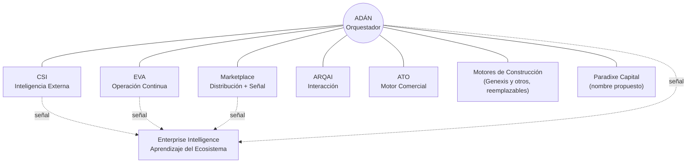

# AD-000 — Paradixe Ecosystem Vision

> Este documento no describe una integración técnica. Declara la posición de ADÁN dentro de un ecosistema de productos que se construyen para compartir valor entre sí. Se escribe con el mismo nivel de exigencia que una constitución: lo que aquí se declara condiciona a todo documento posterior de esta WO-000, y solo puede modificarse mediante una nueva versión con Historial de cambios explícito — nunca editado en el sitio, una vez aprobado.

---

## 1. Propósito de este documento

Antes de que ADÁN tenga una identidad propia (AD-001 Product DNA), debe quedar claro que ADÁN no es un producto aislado ni el primer paso de una secuencia fija. Todo diseño posterior de esta WO-000 —dominio, comportamiento, funcionalidad, UX, arquitectura— se apoya en la premisa de que ADÁN nace dentro de una **red** de capacidades con reglas propias, y que romper esas reglas para optimizar a ADÁN aisladamente es un costo, no una ganancia.

Este documento responde a una sola pregunta: **¿qué es el Ecosistema Paradixe, y qué lugar ocupa ADÁN en él?** No responde qué es ADÁN en sí mismo — eso es AD-001 — ni cómo se gobierna el ecosistema completo a nivel corporativo, lo cual corresponde a un documento de mayor jerarquía, todavía no escrito: la **Constitución de Paradixe** (ver sección 7).

---

## 2. Qué es el Ecosistema Paradixe

Paradixe no construye productos SaaS independientes que compiten por la atención del mismo cliente. Construye un conjunto de capacidades especializadas —impulsadas por IA— que, combinadas, cubren cualquier momento del ciclo de vida de una empresa: crearla, transformarla, automatizarla, hacerla crecer, financiarla, internacionalizarla o reestructurarla. La tesis del ecosistema es que **el valor de cada componente crece con la existencia de los demás**, no a pesar de ellos.

Esto tiene una consecuencia de diseño directa, y es el principio más importante de todo este documento: **ningún componente del ecosistema reconstruye internamente una capacidad que otro componente ya resuelve.** Cuando ADÁN necesita operación financiera continua, se apoya en EVA. Cuando necesita construir software, orquesta un motor de construcción disponible. ADÁN especializado y delgado, apoyado en la red, vale más que ADÁN monolítico e independiente. Este principio —**no duplicación de capacidad**— queda formalizado como el primero de los Principios de Interoperabilidad (sección 4) precisamente porque el Board lo confirmó como fundamental para todo el ecosistema, no solo como una guía de diseño interna de ADÁN.

**Confidence Level de esta sección: 85%** — el principio de no duplicación de capacidad fue confirmado explícitamente por el Board en la revisión de este documento. La tesis general de "valor compuesto entre componentes" sigue siendo una síntesis razonada, no una declaración textual previa.

---

## 3. Componentes del Ecosistema (al momento de esta versión)

| Componente | Rol declarado | Relación con ADÁN | Evidencia |
|---|---|---|---|
| **EVA** | Sistema de operación continua del ecosistema: operación empresarial, optimización, automatización, monitoreo de KPIs, seguimiento, recomendaciones, eficiencia operacional y apoyo estratégico permanente. No se limita a análisis financiero — el análisis financiero es una de sus funciones, no su totalidad | ADÁN diseña la estrategia inicial de negocio (Niveles 1-6); EVA sostiene la operación una vez la empresa está lanzada. En el Nivel 3 (Plan de Negocio), ADÁN se apoya en EVA para que las proyecciones no sean "ilusiones" del fundador | Alta en el componente financiero (Chat 1.docx); Media en el alcance ampliado — dirección confirmada por el Board en esta revisión, sin especificación propia todavía |
| **ARQAI** | Plataforma de interacción del ecosistema: voz, agentes conversacionales, omnicanalidad, atención al cliente, comunicaciones | Provee la capa de voz para Experience Engine y Gamification Engine (AD-FUNC-03/04); reutiliza runtime GPU ya existente (repo Claro/ARQAI) | Alta — confirmado por el Board como producto distinto de ATO, con alcance propio |
| **ATO** | Motor comercial del ecosistema: prospección, generación de demanda, growth, ventas, adquisición de clientes | ADÁN orquesta la validación temprana de mercado; una vez la empresa está lanzada, ATO asume el crecimiento comercial sostenido | Alta — confirmado por el Board como producto distinto de ARQAI, coexistiendo con él |
| **Genexis** | Uno de los motores de construcción tecnológica disponibles en el ecosistema hoy: desarrollo, generación de código, arquitectura técnica, construcción de MVPs. **No es una dependencia exclusiva** — ver sección 4, principio 3 | ADÁN especifica el blueprint del MVP (Nivel 4) y orquesta su construcción usando el motor disponible más adecuado; hoy ese motor suele ser Genexis, pero podría ser otro sin cambiar el diseño de ADÁN | Alta como motor actual; Alta también en que la relación es de orquestación, no de entrega fija — confirmado por el Board en esta revisión |
| **CSI** | Sistema integral de inteligencia empresarial: competencia, mercados, regulación, tendencias, patentes, investigación, open source, noticias, indicadores económicos y comportamiento sectorial. Es la **inteligencia externa** del ecosistema — información que entra desde el mundo hacia Paradixe | ADÁN toma decisiones; CSI le suministra la información externa con la que valida el dolor (Nivel 1) y la propuesta de valor (Nivel 2) | Alta en el núcleo (Chat 1.docx); Alta también en el alcance ampliado — confirmado por el Board en esta revisión |
| **Marketplace** | Canal de publicación y distribución compartido para SaaS, agentes, servicios Paradixe, APIs y partners. Pero no es solo un canal de salida: también **descubre oportunidades, captura señales de mercado, identifica demanda y genera inteligencia** que retroalimenta al resto del ecosistema | ADÁN puede publicar ahí los productos que ayuda a construir (ver AD-FUNC-05); además, la actividad del Marketplace (qué se busca, qué se publica, qué se transacciona) es una fuente de señal para Enterprise Intelligence | Media — canal de distribución nombrado en Blueprint v1; su función de descubrimiento/señal es una ampliación confirmada por el Board en esta revisión, sin mecánica definida todavía |
| **Paradixe Capital** *(nombre propuesto, pendiente de decisión — ver sección 3.1)* | Vehículo de capital del ecosistema con mandato amplio: invertir, adquirir, fusionar, incubar, acelerar, licenciar y financiar — no limitado a inversión temprana | Consume las señales que ADÁN produce (scores, historial, evidencia acumulada); ADÁN nunca decide una operación de capital, solo la informa | Media — mecánica de equity esbozada en Chat 1.docx bajo el nombre "Paradixe Ventures"; el mandato ampliado y el posible cambio de nombre son de esta revisión. Régimen legal reservado en WO-100 |
| **Token del Ecosistema** *(identificador temporal — ver sección 3.2)* | Unidad de intercambio interna del ecosistema, donde resuelve fricción real de cobro entre componentes | Mencionado como medio de prepago para el consumo de niveles en ADÁN | Baja — mencionado dos veces en insumos originales bajo un nombre que este documento ya no usa por riesgo legal (ver 3.2) |
| **Enterprise Intelligence** | Capa de aprendizaje y síntesis a nivel de **todo el ecosistema** — agrega señal de ADÁN, EVA, CSI, ARQAI, ATO y Marketplace para producir conocimiento institucional de Paradixe. Distinta de CSI (que trae inteligencia *externa* hacia adentro) y distinta del Learning Engine de ADÁN (que aprende *solo* del proceso de creación de startups) | Consume el historial y las señales que ADÁN produce, junto con las de los demás componentes; ADÁN no intenta replicar esta capa dentro de su propio Learning Engine (AD-FUNC-09) | Baja-Media — nombrado por el Board como componente del ecosistema; la distinción exacta frente a CSI y frente al Learning Engine de ADÁN es la interpretación de trabajo de este documento, confirmada parcialmente por el Board (ver sección 9 de la retroalimentación: "Learning Engine aprende ADÁN, Enterprise Intelligence aprende Paradixe") |

### 3.1 Paradixe Ventures vs. Paradixe Capital — comparación objetiva

El Board pidió evaluar el cambio de nombre sin decidirlo automáticamente. Comparación:

| Criterio | "Paradixe Ventures" | "Paradixe Capital" |
|---|---|---|
| Percepción externa | Fondo de capital de riesgo clásico: inversión minoritaria en startups de alto riesgo | Vehículo de capital de alcance más amplio: invierte, adquiere, financia |
| Cobertura del mandato descrito | Cubre bien "invertir"; no comunica "adquirir", "fusionar", "incubar", "acelerar" ni "licenciar" | Cubre naturalmente invertir, adquirir, fusionar y financiar; "incubar", "acelerar" y "licenciar" quedan implícitos pero no explícitos en el nombre |
| Precedentes de mercado | Fondos corporativos de inversión pura (ej. Google Ventures, M12 de Microsoft) — no operan, no adquieren empresas completas | Firmas con mandato diversificado (private equity + M&A + venture) suelen evitar el sufijo "Ventures" precisamente porque limita la percepción |
| Riesgo de sub-representar el mandato descrito por el Board | Alto | Bajo |
| Riesgo de sobre-generalizar y perder la identidad de "constructor de empresas" propia de Paradixe | Bajo | Medio — "Capital" solo, sin contexto, puede sonar a fondo genérico sin la identidad de venture builder que tiene el ecosistema |

**Recomendación (no decisión):** *"Paradixe Capital"* representa mejor el mandato descrito por el Board — invertir, adquirir, fusionar, incubar, acelerar, licenciar, financiar — porque "Ventures" comunica externamente un alcance más estrecho del que el ecosistema realmente tiene. Alternativa a evaluar por el Board, no impuesta por este documento: mantener "Paradixe Ventures" como el brazo específico de inversión temprana dentro de una entidad paraguas más amplia llamada "Paradixe Capital", si el Board considera valioso preservar ambos nombres para públicos distintos. La decisión final de branding —incluida disponibilidad de marca— no le corresponde a este documento; queda registrada en Decisiones pendientes.

### 3.2 Nota sobre el nombre "Applecoin"

Este documento deja de usar el nombre "Applecoin" desde esta revisión, por instrucción directa del Board: Apple es conocida por una defensa de marca extremadamente agresiva, y adoptar ese nombre desde una fase temprana del ecosistema es un riesgo legal evitable. En su lugar, este y todos los documentos posteriores de la WO-000 deben referirse a este componente como **"Token del Ecosistema"** — un identificador neutral y temporal, no un nombre comercial final. La decisión de nombre definitivo queda registrada en Decisiones pendientes, y debe involucrar una búsqueda de disponibilidad de marca antes de fijarse.

---

## 4. Principios de Interoperabilidad

Estos principios rigen cómo ADÁN se relaciona con el resto del ecosistema. Se proponen aquí porque ADÁN los necesita para diseñarse correctamente; su adopción formal a nivel de todo el ecosistema le corresponde a la futura Constitución de Paradixe (sección 7).

1. **No duplicación de capacidad.** Ningún componente del ecosistema reconstruye internamente una capacidad que otro componente ya resuelve. Confirmado por el Board como principio fundamental de todo el ecosistema, no solo como guía de diseño de ADÁN.
2. **ADÁN orquesta; no monopoliza el flujo.** El ecosistema es una red de capacidades interconectadas, no una secuencia fija de productos. Una empresa puede entrar al ecosistema en cualquier punto de su ciclo de vida — ver sección 5.
3. **Ningún motor es una dependencia exclusiva.** Todo proveedor, interno o externo, que ejecute una capacidad del ecosistema (construcción de software, interacción por voz, generación de demanda comercial) es reemplazable sin romper el diseño de ADÁN. Genexis es el motor de construcción actual, no el único posible; lo mismo aplica a cualquier otro proveedor que hoy ocupe un rol específico.
4. **Contrato explícito, no acceso directo.** Un componente nunca lee o escribe directamente en la base de datos de otro. Toda relación entre ADÁN y EVA/ARQAI/ATO/Genexis/CSI pasa por un contrato de API versionado (especificado más adelante en AD-ARQ-08 e individualmente en AD-INT-01 a AD-INT-05).
5. **Una sola fuente de verdad por entidad.** Si el Gemelo Digital (AD-007) representa una empresa, ningún otro componente del ecosistema mantiene su propia copia divergente de esa misma empresa; la consultan o la referencian, no la reescriben.
6. **El Token del Ecosistema se usa donde resuelve fricción real de cobro entre componentes**, no como requisito universal — no todo intercambio de valor dentro del ecosistema tiene que pasar por una moneda interna.
7. **Ningún componente es dueño exclusivo de la relación con el cliente.** El fundador que usa ADÁN es el mismo que eventualmente usará EVA, ARQAI, ATO o el Marketplace; su identidad e historial deben ser reconocibles a través de todo el ecosistema, no reiniciarse en cada componente.

**Confidence Level de esta sección: 65%** — el principio 1 fue confirmado explícitamente por el Board; los principios 2 y 3 derivan directamente de la retroalimentación de esta revisión (modelo de red, independencia de motor); los principios 4, 5, 6 y 7 siguen siendo propuestos por consistencia de diseño, pendientes de ratificación por la futura Constitución de Paradixe.

---

## 5. El lugar de ADÁN en el Ecosistema

ADÁN no es el primer eslabón de una cadena de productos. **ADÁN es el orquestador**: el componente del ecosistema que decide qué otras capacidades activar, en qué orden y con qué motor, según el punto exacto en el que una empresa entra al ecosistema. Una empresa no tiene que empezar en "cero" para que ADÁN participe.

Puntos de entrada reconocidos al ecosistema a través de ADÁN (lista no cerrada — su gobierno detallado es responsabilidad de AD-004 Product Evolution, no de este documento):

- Creación de una empresa desde una idea (el flujo de los 7 Niveles, caso de uso original)
- Transformación digital de una empresa existente
- Automatización de procesos ya operativos
- Crecimiento y escalamiento de una empresa ya lanzada
- Internacionalización a un nuevo mercado
- Levantamiento de capital o preparación para inversión
- Optimización operacional de una empresa existente
- Reingeniería de un modelo de negocio
- Adquisición o fusión con otra empresa

En cada punto de entrada, ADÁN activa un subconjunto distinto de capacidades del ecosistema — no siempre las mismas, no siempre en el mismo orden. Especificar exactamente qué combinación corresponde a cada punto de entrada es trabajo de un documento posterior (probablemente una ampliación de AD-FUNC-01 o un nuevo documento de Fase 2, a decidir cuando se llegue a Funcionalidades); aquí solo se establece el principio de que esa combinación es variable, no fija.

La centralidad de ADÁN en este diagrama refleja su rol de orquestador en los puntos de entrada listados arriba, no una posición de superioridad sobre los demás componentes. Existen además relaciones entre pares de componentes que no involucran a ADÁN directamente (por ejemplo, EVA y CSI comparten indicadores económicos, o Marketplace y CSI comparten señal de demanda) — esas relaciones están fuera del alcance de este documento y se especificarán, si corresponde, en el Ecosystem Vision de cada componente correspondiente.

**Confidence Level de esta sección: 60%** — el rol de orquestador y la lista de puntos de entrada son la corrección directa del Board en esta revisión, reemplazando el modelo de cadena de la versión anterior; la combinación exacta de capacidades por punto de entrada sigue sin especificarse y queda como trabajo futuro explícito, no implícito.

---

## 6. Qué jamás hará ADÁN dentro del Ecosistema

Estos límites existen para que ADÁN no compita por diseño con sus propios socios de ecosistema, incluso teniendo el rol de orquestador:

- ADÁN **nunca** se convierte en el sistema de operación continua de una empresa ya lanzada — ese es el rol que asume EVA una vez la empresa opera (Nivel 6 en adelante, Operación Continua, reservado en WO-100).
- ADÁN **nunca** ejecuta directamente la construcción técnica del producto — orquesta el motor de construcción disponible en cada momento (hoy Genexis, potencialmente otros mañana), pero la decisión de cuál usar y cómo integrarlo es siempre de ADÁN; nunca queda atado de forma permanente a un proveedor específico.
- ADÁN **nunca** sustituye la función comercial continua de una empresa lanzada — ATO y los motores de crecimiento del ecosistema asumen esa función una vez la empresa opera; ADÁN se limita a la validación temprana de mercado, apoyado en CSI.
- ADÁN **nunca** mantiene su propia copia de la inteligencia externa que CSI ya produce, ni intenta replicar el aprendizaje agregado de Enterprise Intelligence — los consume a ambos.
- ADÁN **nunca** decide unilateralmente una operación de Paradixe Capital (inversión, adquisición, fusión, licenciamiento); produce la evidencia (scores, historial, evidencia acumulada) que la informa, pero la decisión es de un comité independiente, ya declarado así en Blueprint v1.

---

## 7. Relación con la futura Constitución de Paradixe

Este documento no reemplaza ni anticipa la Constitución de Paradixe que el Board ha decidido escribir en paralelo, fuera de esta WO-000. Esa Constitución gobernará a todos los componentes del ecosistema —EVA, ARQAI, ATO, Genexis (y otros motores de construcción), CSI, Marketplace, Paradixe Capital, ADÁN y los que vengan después—, no solo a ADÁN. Cuando exista, los Principios de Interoperabilidad de la sección 4 de este documento deberán revisarse contra ella y, si hay conflicto, la Constitución de Paradixe prevalece y este documento se actualiza a una nueva versión, con su Historial de cambios documentando exactamente qué cambió y por qué.

Hasta entonces, AD-000 declara únicamente los principios de ecosistema que ADÁN necesita para diseñarse a sí mismo con coherencia — no reclama autoridad sobre el resto del ecosistema.

---

## 8. Evolución del Ecosistema

Se espera que el Ecosistema Paradixe crezca más allá de los nueve componentes listados en la sección 3, y que la red de capacidades se vuelva más densa —no solo más grande— a medida que aparecen relaciones directas entre componentes que hoy solo se conectan a través de ADÁN. Las reglas específicas de cuándo un componente nuevo se suma al ecosistema, cuándo dos componentes se fusionan, o cuándo un componente se retira, son responsabilidad de la Constitución de Paradixe (sección 7), no de este documento. Lo único que AD-000 fija es que ADÁN debe diseñarse asumiendo que esta red crecerá y se reconfigurará — de ahí que AD-004 (Product Evolution) exista como documento separado, dedicado exclusivamente a las reglas de evolución del propio ADÁN dentro de esa red cambiante.

---

## Dependencias

Ninguna — este es el documento raíz de la WO-000.

## Documentos relacionados

- AD-001 Product DNA (hereda directamente de este documento)
- AD-004 Product Evolution (reglas de evolución de ADÁN dentro de esta red)
- AD-005 Enterprise Domain Model (modela "Empresa", "Mercado", "Competencia" — conceptos ya usados aquí de forma no formal)
- AD-FUNC-05 Marketplace, AD-FUNC-09 Learning Engine (funcionalidades que dependen de la posición de ADÁN en el ecosistema descrita en la sección 3)
- AD-INT-01 a AD-INT-05 (contratos técnicos de cada integración nombrada en la sección 3 — ahora cinco, no cuatro, al separar ARQAI de ATO; el índice maestro deberá actualizarse para reflejar esta quinta integración cuando se llegue a esa fase)
- Reservados en WO-100: Marco Legal (régimen de Paradixe Capital y del Token del Ecosistema), Programa AAA

## Impacto sobre otros módulos

Todo documento de la WO-000 hereda de este. Tres impactos concretos de esta revisión:

1. La sección 5 reemplaza el modelo de cadena lineal por el modelo de red/orquestación — cualquier documento que en el futuro describa el flujo de ADÁN debe partir de este modelo, no del anterior.
2. El alcance ampliado de EVA (operación continua, no solo financiero) y de CSI (inteligencia integral, no solo mercado) afecta directamente el alcance que deberá tener AD-INT-01 (Integración EVA) y AD-INT-04 (Integración CSI) cuando se redacten — hoy el índice maestro (`WO-000_INDICE_MAESTRO_v3.1.md`) todavía describe a EVA como "cerebro financiero" y a CSI como "inteligencia de mercado"; ese texto queda desactualizado por esta revisión y deberá alinearse cuando se llegue a esa fase.
3. Se agrega ATO como quinto componente de integración, separado de ARQAI — cualquier plan de Fase 2 (Integraciones) que asumiera cuatro integraciones debe ajustarse a cinco.

## Riesgos

- **Riesgo de autoridad prematura:** que este documento termine, en la práctica, funcionando como la Constitución de Paradixe por defecto (al ser el primero en existir), aunque explícitamente declara no serlo. Mitigación: la sección 7 deja esto por escrito; cuando la Constitución exista, este documento debe revisarse contra ella de inmediato.
- **Riesgo de nombre no resuelto en dos componentes:** Paradixe Capital/Ventures y el Token del Ecosistema todavía no tienen nombre definitivo. Cualquier documento posterior que use un nombre distinto a "Paradixe Capital (propuesto)" o "Token del Ecosistema" antes de que el Board decida introduce inconsistencia — ver Decisiones pendientes.
- **Riesgo de dependencia no correspondida:** los principios de la sección 4 asumen reciprocidad (ej. EVA también evita duplicar lo que ADÁN resuelve), pero este documento no puede exigirle nada a EVA, ARQAI, ATO, Genexis o CSI — son componentes con su propia gobernanza. El riesgo es que ADÁN diseñe su interoperabilidad en un solo sentido.
- **Riesgo de alcance no especificado:** el mandato ampliado de EVA y CSI (sección 3) es una dirección confirmada por el Board, no una especificación. Si AD-INT-01 o AD-INT-04 se redactan antes de que EVA/CSI tengan su propio documento de alcance, existe riesgo de que ADÁN le asigne responsabilidades que esos productos no han aceptado formalmente.

## Preguntas abiertas

1. **Combinación de capacidades por punto de entrada (sección 5).** Se listaron nueve puntos de entrada posibles al ecosistema a través de ADÁN, pero no se especificó qué combinación exacta de componentes se activa en cada uno. Queda pendiente definir esto en Fase 1 (probablemente dentro de AD-FUNC-01 o un documento nuevo).
2. **Relaciones entre pares de componentes que no pasan por ADÁN** (ej. EVA↔CSI, Marketplace↔CSI). Se reconoce que existen pero quedan fuera del alcance de este documento.

*(Las preguntas sobre ARQAI/ATO y sobre Enterprise Intelligence de la versión anterior quedaron resueltas por el Board — ver Historial de cambios.)*

## Decisiones pendientes

- **Nombre definitivo de "Paradixe Capital" vs. "Paradixe Ventures".** Recomendación de este documento: Paradixe Capital (sección 3.1). Decisión final del Board, incluida validación de disponibilidad de marca.
- **Nombre comercial definitivo del Token del Ecosistema**, evaluado desde ya por riesgo de marca (no puede ser "Applecoin"). Este documento usa "Token del Ecosistema" como identificador neutral mientras tanto.
- Decidir si el Token del Ecosistema merece un documento propio dentro de WO-100 o si su alcance es lo suficientemente pequeño como para vivir como una sección de un documento existente.
- Especificar formalmente el alcance ampliado de EVA y de CSI en sus respectivos documentos de integración (AD-INT-01, AD-INT-04) antes de asumir que ese alcance ya está aceptado por esos productos.
- Ratificar, modificar o descartar los Principios de Interoperabilidad de la sección 4 una vez exista la Constitución de Paradixe.

## Historial de cambios

| Versión / Revisión | Fecha | Cambio | Motivo |
|---|---|---|---|
| v1.0 (Revisión 1) | 2026-07-14 | Creación inicial del documento | Primer documento de la WO-000 tras la aprobación del árbol v3.1 |
| v1.0 (Revisión 2 — pre-aprobación) | 2026-07-14 | (1) Reemplazado el modelo de cadena lineal por modelo de red/orquestación (sección 5). (2) ADÁN deja de "depender" de Genexis — se reformula como orquestación de motores de construcción intercambiables. (3) EVA ampliada de "cerebro financiero" a "sistema de operación continua". (4) CSI ampliada de "inteligencia de mercado" a "sistema integral de inteligencia empresarial". (5) Se separa ATO de ARQAI como componentes distintos — pregunta abierta anterior resuelta. (6) Se agrega comparación Paradixe Ventures vs. Paradixe Capital, con recomendación no vinculante. (7) Se amplía el rol de Marketplace a descubrimiento/señal, no solo distribución. (8) Se retira el nombre "Applecoin" por riesgo legal de marca, reemplazado por "Token del Ecosistema" como identificador temporal. (9) Se mantiene sin cambios la separación Learning Engine / Enterprise Intelligence, confirmada correcta por el Board. Nota de versionado: no se incrementó a v1.1 porque v1.0 (Revisión 1) nunca fue aprobada — la disciplina de congelamiento aplica solo a documentos aprobados; a partir de la aprobación de esta revisión, cualquier cambio futuro sí generará v1.1 o v2.0 según corresponda | Retroalimentación explícita del Board tras revisión de v1.0 (Revisión 1) |
| v1.0 — Aprobada | 2026-07-14 | Aprobación formal del Board. Sin cambios de contenido respecto a Revisión 2 — solo cambia el estado del documento de Draft a Aprobado y se congela. Primer documento de la WO-000 en cruzar la disciplina de versionado en pleno efecto: a partir de aquí, cualquier cambio futuro a este archivo debe crear v1.1 (menor) o v2.0 (estructural), nunca editarlo en el sitio | Cierre del ciclo de revisión de AD-000 |
