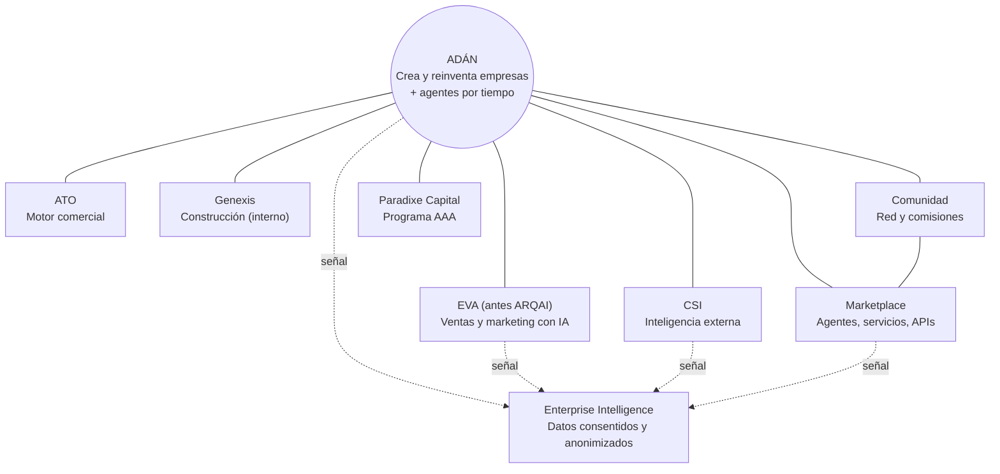

# AD-000 — Paradixe Ecosystem Vision (v2.0)

> Igual que v1.0, este documento no describe integraciones técnicas: declara qué lugar ocupa ADÁN dentro del Ecosistema Paradixe. Se versiona a v2.0 y no a v1.1 porque cambia la estructura del ecosistema: dos componentes se fusionan (ARQAI pasa a ser EVA), uno cambia de rol (EVA), uno deja de ofrecerse al cliente (Genexis), aparece uno nuevo (Comunidad) y ADÁN suma una segunda forma de servir a las empresas (agentes por tiempo).

---

## 1. Qué cambia respecto a v1.0

| Tema | v1.0 | v2.0 (AD-DEC-0002) |
|---|---|---|
| EVA | Operación continua de la empresa, incluidas las finanzas | **Ventas y marketing con IA**: campañas inbound y outbound, voz, agentes conversacionales y omnicanalidad |
| ARQAI | Voz, interacción y omnicanalidad, como producto aparte | **Es el mismo producto que EVA** y pasa a llamarse EVA |
| Genexis | Motor de construcción que el cliente podía contratar | **Motor interno**: lo usa ADÁN y no se vende como paquete de desarrollo |
| ADÁN | Orquestador que diseña la empresa (Niveles 1-6) y se retira cuando la empresa opera | Crea o reinventa empresas **y suministra agentes por hora, día, semana o mes** para tareas específicas de cada empresa |
| Comunidad | Diferida (hallazgo H-5 del blueprint consolidado) | **Componente del ecosistema**: red de emprendedores y empresas, soporte de la red de comisiones |
| Finanzas del Nivel 3 | Proyecciones verificadas "vía EVA" | Las hace el **agente CFO de ADÁN**, contrastadas con benchmarks de **CSI** |
| Paradixe Capital (AAA) | Mecánica de equity esbozada al 50 % | **Equity negociado caso por caso** |
| Responsabilidad | No tratada | **Aviso permanente**: ADÁN es una IA, no reemplaza la asesoría profesional y Paradixe no responde por los resultados |

Lo que **no** cambia:
- La tesis del ecosistema (§2).
- El rol de ADÁN como orquestador (§5).
- Los Principios de Interoperabilidad, salvo el ajuste al principio 3 (§4).
- La relación con la futura Constitución de Paradixe (§8).

---

## 2. Qué es el Ecosistema Paradixe

Sin cambios respecto a v1.0.

Paradixe construye un conjunto de capacidades especializadas, impulsadas por IA, que combinadas cubren cualquier momento del ciclo de vida de una empresa: crearla, reinventarla, venderle al mercado, financiarla y hacerla crecer. La tesis es que **el valor de cada componente crece con la existencia de los demás**.

El principio más importante sigue siendo el mismo: **ningún componente reconstruye una capacidad que otro ya resuelve.**

---

## 3. Componentes del Ecosistema

| Componente | Rol | Relación con ADÁN | Fuente |
|---|---|---|---|
| **ADÁN** | Crea o reinventa empresas, con los 7 Niveles y los demás puntos de entrada de §5. Además suministra **agentes por tiempo** (hora, día, semana o mes) que hacen tareas específicas para cada empresa. | — | AD-DEC-0002, decisiones 1 y 9 |
| **EVA** *(antes ARQAI)* | Ventas y marketing con IA: campañas inbound y outbound, voz, agentes conversacionales y omnicanalidad | ADÁN diseña la propuesta de valor y valida el mercado; EVA lleva el producto al mercado de forma continua. La capa de voz del Experience Engine (AD-FUNC-03) y del Onboarding (AD-FUNC-06) la pone EVA. | AD-DEC-0002, decisiones 0 y 1 |
| **ATO** | Motor comercial: prospección, generación de demanda y growth | Sin cambios frente a v1.0. **Se solapa con EVA** en campañas y generación de demanda (ver Riesgos). | AD-000 v1.0; AD-DEC-0002 §3.1 lo deja como estaba |
| **Genexis** | Motor **interno** de construcción de software: arquitectura, código y MVPs | ADÁN especifica el MVP en el Nivel 4 y lo construye a través de Genexis, con modelos de Anthropic. El cliente recibe el MVP, no un contrato de desarrollo. | AD-DEC-0002, decisiones 2 y 3 |
| **CSI** | Inteligencia externa: mercado, competencia, regulación, tendencias e indicadores | Valida el dolor (Nivel 1) y la propuesta de valor (Nivel 2). También da los benchmarks con que el CFO de ADÁN contrasta las finanzas del Nivel 3. | AD-000 v1.0; AD-DEC-0002 §3.1 |
| **Marketplace** | Publicación y venta de agentes, servicios y APIs del ecosistema y de terceros, además de señal de demanda | Es donde se publican y se contratan los **agentes por tiempo** de ADÁN y los productos que ADÁN ayuda a construir. AD-FUNC-05 consume su señal para recomendar recursos. | AD-DEC-0002, decisión 1 |
| **Comunidad** *(nuevo)* | Red de emprendedores y empresas del ecosistema, y soporte de la red de comisiones ("Ondas Expansivas") | Los clientes de ADÁN entran a la Comunidad; la Comunidad trae nuevos clientes a ADÁN por la red de comisiones | AD-DEC-0002, decisiones 1 y 4 |
| **Paradixe Capital** | Programa AAA: invierte, adquiere o financia con **equity negociado caso por caso** | ADÁN produce la evidencia (Scores, historial, Gemelo Digital); **nunca decide** la operación: la decide un comité independiente. | AD-DEC-0002, decisión 5 |
| **Token del Ecosistema** | Unidad de intercambio interna, donde resuelva una fricción real de cobro | Sin cambios frente a v1.0 | AD-000 v1.0 §3.2 |
| **Enterprise Intelligence** | Aprendizaje agregado de todo el ecosistema | Sin cambios. Nueva regla: **solo trabaja con datos consentidos y anonimizados**, y vende inteligencia agregada, nunca datos crudos (Ley 1581 de 2012). | AD-DEC-0002, decisión 8 |

### 3.1 Modelos de IA en el ecosistema

- **Ollama avanzado** para tareas simples.
- **Agentes de Anthropic** (Haiku, Sonnet, Opus) según la complejidad.
- Los MVPs del Nivel 4 se construyen con Anthropic.

La elección del modelo es una decisión de cada tarea, no de cada componente. Ningún componente queda atado a un proveedor (principio 3).

### 3.2 Nombres pendientes

- **"Paradixe Capital"** es el nombre que usa AD-DEC-0002. La validación de marca de v1.0 §3.1 sigue pendiente.
- **"Token del Ecosistema"** sigue siendo un identificador temporal; no puede llamarse "Applecoin" (v1.0 §3.2).

---

## 4. Principios de Interoperabilidad

Los siete principios de v1.0 se mantienen. Un ajuste:

1. **No duplicación de capacidad.** Sin cambios.
2. **ADÁN orquesta; no monopoliza el flujo.** Sin cambios.
3. **Ningún motor es una dependencia exclusiva.** Se mantiene, con una precisión: que Genexis sea interno no lo convierte en dependencia exclusiva. ADÁN puede usar otro motor de construcción, u otro proveedor de modelos, sin cambiar su diseño.
4. **Contrato explícito, no acceso directo.** Sin cambios. Las integraciones quedan en cuatro:
   - EVA (que absorbe la de ARQAI);
   - ATO;
   - Genexis;
   - CSI.

   Marketplace y Comunidad se integran por API igual que los demás.
5. **Una sola fuente de verdad por entidad.** Sin cambios. El Gemelo Digital (AD-007) es la referencia de cada empresa para todo el ecosistema.
6. **Token del Ecosistema solo donde resuelve fricción.** Sin cambios.
7. **Ningún componente es dueño exclusivo de la relación con el cliente.** Sin cambios, y ahora incluye a la Comunidad: la identidad del cliente se reconoce en todo el ecosistema.

---

## 5. El lugar de ADÁN en el Ecosistema

ADÁN sirve a las empresas de dos formas.

**A. Crear o reinventar una empresa.** Es el orquestador de v1.0. Decide qué capacidades del ecosistema activar según el punto de entrada:
- creación desde una idea, que es el recorrido de los 7 Niveles;
- transformación digital;
- automatización;
- crecimiento;
- internacionalización;
- levantamiento de capital;
- optimización;
- reingeniería;
- adquisición o fusión.

**B. Suministrar agentes por tiempo.** Una empresa, creada o no con ADÁN, contrata agentes por hora, día, semana o mes para tareas específicas. Estos agentes:
- trabajan con la memoria de la empresa (EMS) y con las herramientas que la empresa autorice (TEF);
- rinden cuentas de lo que hicieron;
- se publican y se contratan en el Marketplace.

Son el ingreso recurrente de ADÁN y reemplazan la "membresía operativa" de planes fijos (AD-DEC-0002 §3.2).

---

## 6. Qué jamás hará ADÁN dentro del Ecosistema

- **Hacer las ventas y el marketing continuos de una empresa.** Eso es de EVA. ADÁN valida el mercado y diseña la propuesta de valor. Sus agentes por tiempo pueden hacer tareas acotadas que el cliente contrate, pero no reemplazan a EVA.
- **Vender desarrollo de software.** Genexis es interno. El cliente recibe el MVP de su Nivel 4, no un paquete de desarrollo.
- **Guardar su propia copia** de la inteligencia de CSI, ni replicar el aprendizaje de Enterprise Intelligence.
- **Decidir una operación de Paradixe Capital.** Solo produce la evidencia.
- **Decidir por el cliente.** El Board y los agentes proponen y el cliente aprueba (Patrón A, AD-008). Esto se implementó en WO-095.
- **Presentarse como asesoría profesional.** En todo momento muestra el aviso de §7.

Se retira el límite de v1.0 "ADÁN nunca se convierte en el sistema de operación continua". Lo reemplazan los dos primeros puntos de esta lista.

---

## 7. Responsabilidad y avisos

ADÁN no tiene límites temáticos. En todo momento, en la interfaz, en cada documento generado y en las respuestas de la API, muestra este aviso:

> ADÁN es una inteligencia artificial. Sus análisis y recomendaciones no reemplazan la asesoría de profesionales (legal, tributaria, financiera u otra), y Paradixe no se hace responsable por los resultados de las decisiones que se tomen con base en ellos.

El texto vive en `backend/app/core/disclaimer.py` y en `frontend/src/components/AiDisclaimer.jsx` (WO-095). Cualquier componente del ecosistema que muestre resultados de ADÁN debe mostrarlo también.

---

## 8. Relación con la futura Constitución de Paradixe

Sin cambios frente a v1.0 §7. Si la Constitución de Paradixe entra en conflicto con este documento, la Constitución prevalece y este documento se versiona.

---

## Dependencias

- AD-DEC-0002 (fuente de todas las decisiones de esta versión).
- AD-000 v1.0 (lo que no cambia).

## Documentos que esta versión deja desactualizados

No se editan en el sitio. Cada uno se versiona cuando se toque su WO:

| Documento | Texto afectado | WO que lo actualiza |
|---|---|---|
| AD-001 v1.1 §1.1 | "Un ERP" y "un sistema contable o de facturación" son "responsabilidad de EVA". Con el nuevo EVA, esas capacidades no tienen dueño en el ecosistema (ver Preguntas abiertas). | WO-100 |
| AD-FUNC-01 v1.0, Nivel 3 | Proyecciones "vía EVA" | WO-111 (CFO de ADÁN + CSI) |
| AD-FUNC-03 v1.0 y AD-FUNC-06 v1.0 | Voz por "AD-INT-02, ARQAI" | WO-119 (voz por EVA) |
| AD-FUNC-05 v1.0 | "Genexis, EVA, ARQAI..." como motores | WO-117 |
| `WO-000_INDICE_MAESTRO_v3.21` | EVA como "cerebro financiero"; cinco integraciones AD-INT | Próxima versión del índice |
| `kg.json` | Nodo AD-000 | Actualizado en WO-096 |

## Riesgos

- **Solapamiento EVA–ATO.** EVA hace campañas inbound y outbound, y ATO hace prospección y generación de demanda. Si EVA absorbe también el motor comercial, debe registrarse en un AD-DEC posterior (AD-DEC-0002 §3.1).
- **Capacidades sin dueño.** ERP, contabilidad y facturación quedaron sin componente al cambiar el rol de EVA.
- **Cumplimiento de la red de comisiones.** La Comunidad soporta un sistema multinivel. Debe cumplir la Ley 1700 de 2013 desde el primer día: comisiones sobre ventas reales, plan de compensación publicado, contratos escritos y vigilancia de la Superintendencia de Sociedades. Se diseña en WO-100 y WO-121.

## Preguntas abiertas

1. ¿Quién resuelve ERP, contabilidad y facturación para las empresas creadas con ADÁN: un tercero recomendado por AD-FUNC-05, un agente por tiempo o un componente nuevo?
2. ¿EVA absorbe a ATO?
3. Siguen abiertas las de v1.0: la combinación de capacidades por punto de entrada y las relaciones entre pares de componentes.

## Historial de cambios

| Versión | Fecha | Cambio | Motivo |
|---|---|---|---|
| v1.0 | 2026-07-14 | Creación y aprobación | Primer documento de la WO-000 |
| v2.0 | 2026-09-24 | Se aplican las siete decisiones de AD-DEC-0002 que afectan al ecosistema: 1. EVA = ventas y marketing. 2. ARQAI se funde en EVA. 3. Genexis pasa a ser interno. 4. Se suma la Comunidad. 5. ADÁN suministra agentes por tiempo. 6. Las finanzas del Nivel 3 pasan al CFO de ADÁN con CSI. 7. Equity de AAA negociado y aviso de IA permanente. Además, las integraciones AD-INT pasan de cinco a cuatro. | AD-DEC-0002 (Hernán, 2026-09-24), ejecutado en WO-096 |
